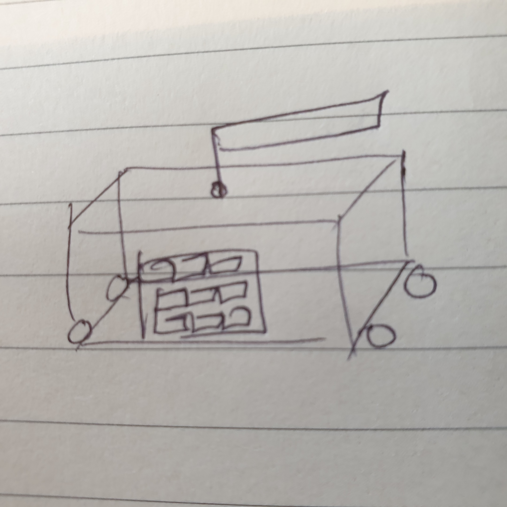
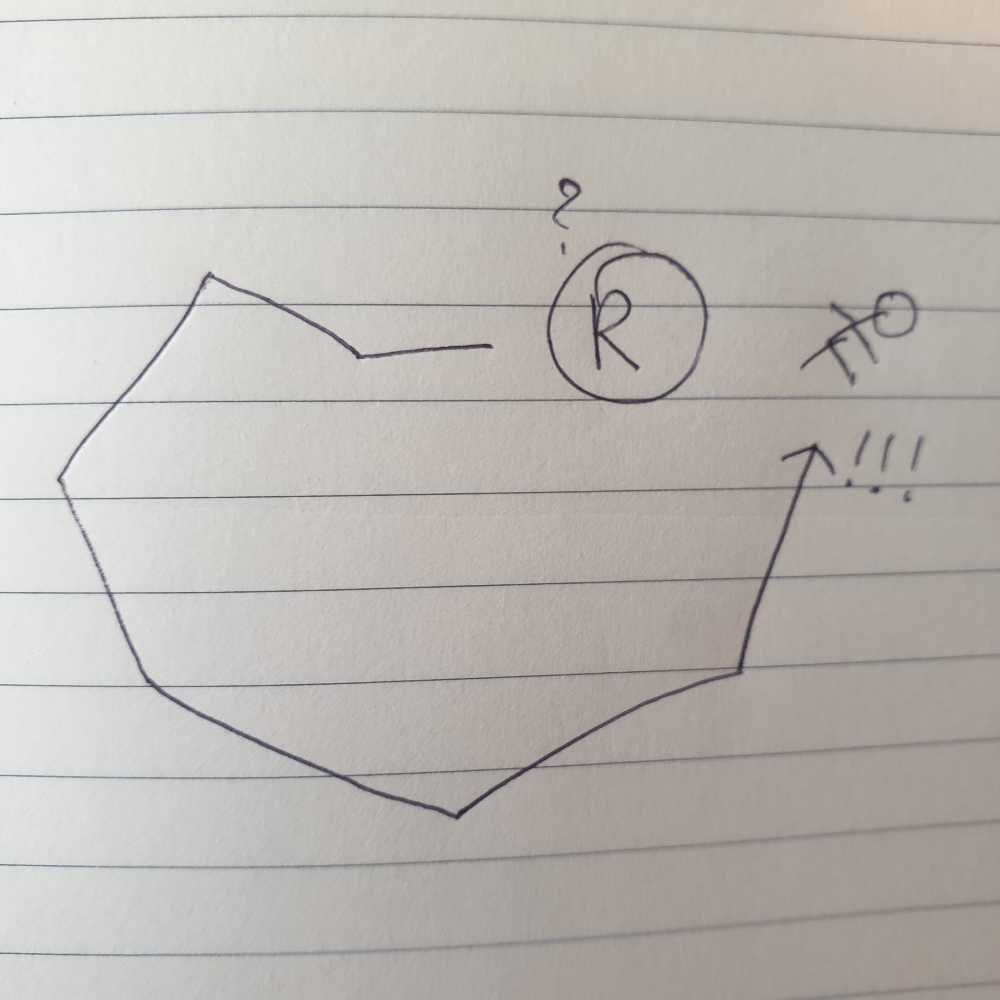
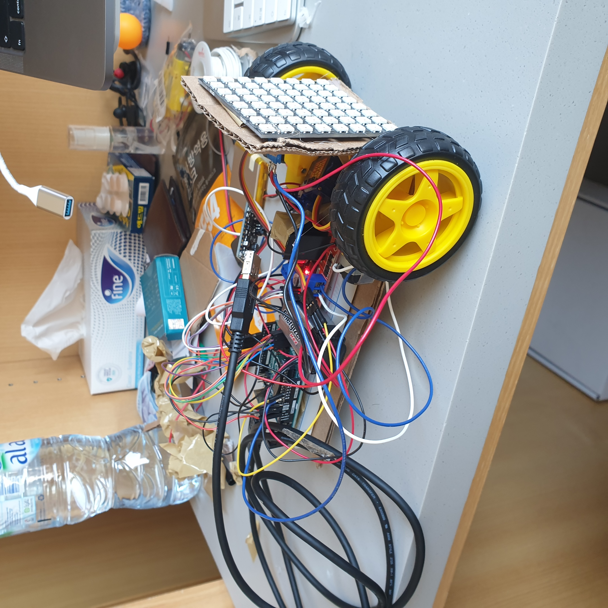
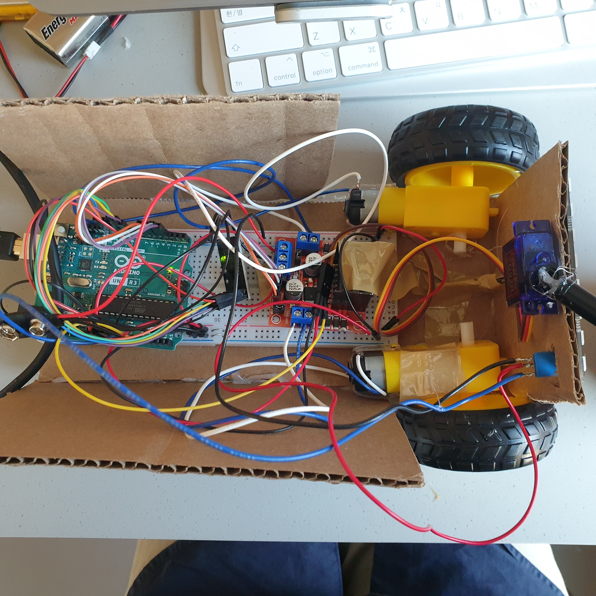
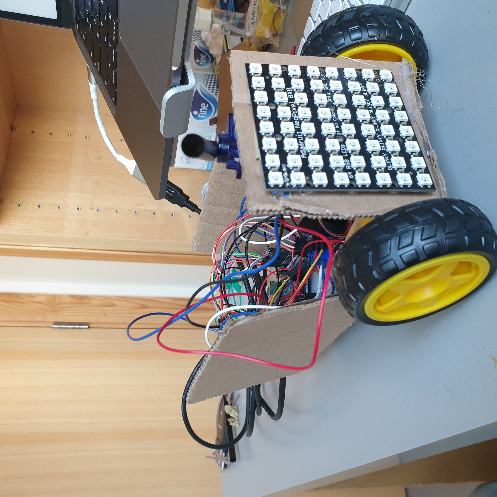
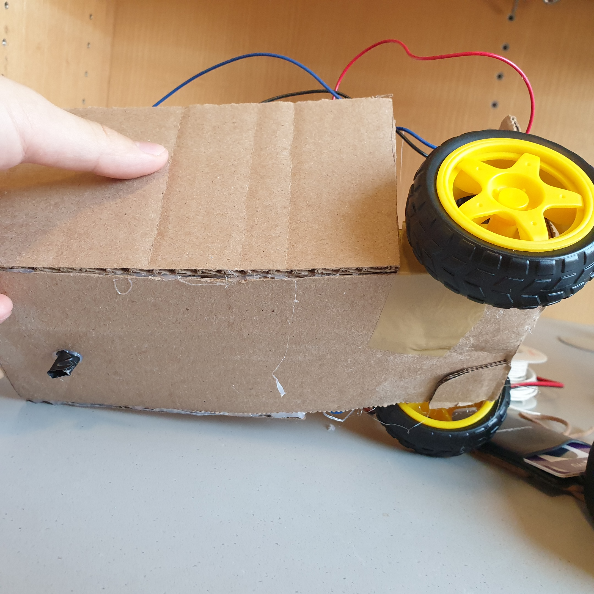

# Documentation
## Idea
### Appearance

I want to build a robot that moves around looking for an object. Its appearance is very roughly (sorry, my drawing is really bad) shown in the image above. It's basically a box with neo-pixel on the front that moves on wheels. It also has a spinning stick on the top that is supposed to mimic a radar. The goal for this project would be to build this box as sturdy as possible since it's usually fragility of mechanical parts that prevent me to go further. So, I would like to first make it hard and simple. 
### Performance

Since the mission of the robot (I'll assume it's a he/him for now) is to find an object (I'm thinking about a cute doll), the performance starts with the robot looking for the object. Although the object is right behind him, he does not recognize it because he can only sense what's in front of himself. So, he moves around looking for the object until he draws a circle and comes back to the original spot facing the object. The route is as depicted in the image above.
### Expression
Neo-pixel and movement are the two ways I will use to make him expressive. When he is yet to find the object and still searching for it, the number of lights lit on the neo-pixel would be small or even 1 and the change of lighted pixels would be slow. The movement of the robot would also be slow, all of the signs intended to convey how careful and vigilant he is. Finally when he finds the object, he expresses joy with colorful and chaotic pattern of neo-pixel and also fast and jittery movement.
## Process
### Step 1.
First part was building each component and soldering it / connecting it firmly so that bad connection does not bug me later. I wanted to make sure all components (motors, neopixel and servo motor) were tested separately before building the whole thing.
### Step 2. 
Next part was writing Arduino code that syncs all the parts. I wanted my program to meet the following criteria:
1. Servo motor is moving at all times.
2. Neopixel and motor do not work together. They work in different phases of the program.
In order to make this happen, I had to make use of states and `millis()`. In a `SEARCHING` state, motors do not work and the neopixel puts out red light in a pattern that gives a sense of surveillance. Then comes the `MOVING` phases where the neopixel stops and the motors start working, moving him forward. After 3 repetitions of `SEARCHING` and `MOVING`, he enters the `FOUND` phase where the servo motor speeds up and the neopixel shines in rainbows in order to express joy and excitement. 
In between state changes, I inserted a `DELAY` phase where he waits for a short period of time. I inserted the state in order to simulate human decision-making. We do not change actions immediately. It takes time for humans to move from one action to another. 
I checked `SEARCHING` and `MOVING` with `DELAY`s in between were working in sync before building the frame because I thought it would be difficult to rewire stuff and constantly update code after building the frame.
[link](https://youtu.be/lY9TRG7qjzc "sync components")
### Step 3. 
The last major step was building the frame. Due to lack of pins and power, I decided to use only two wheels. And I attached a piece of straw on the back and bottom of the frame so the frame was more horizontal. 
In order to build the radar, I tested the range of movement of the servo motor so that the straw attached to the part only sweeps the front. 
Attaching the motors to the cardboard was the most difficult because they didn't stick well with the tape and glue gun I had. I somehow managed to stick them using both but next time, I might need a stronger double sided tape.
Then, I put all the other components on top of the frame, and fortunately, it didn't collapse.

[Function Demo](https://youtu.be/3j9IytzPoEM "function demo")
## Obstacles / Lessons Learned
1. Power: I ran into difficultires due to the lack of battery power. After testing my motors, one of them suddenly stopped working. I went through the hassle of checking the connectivity using the multimeter, switching pins, and re-soldering the motor just to find out that it was lack of battery causing the problem. I switched the battery and it worked fine. Similar thing happened when I was testing the final iteration. The robot suddenly stopped moving and it was the battery again. Two things to keep in mind: motors take up a lot of energy, detach the battery whenever it's not in use.
2. `unsigned long` for `millis()`: It is my fault that I forgot to use `unsigned long` for variables storing value of `millis()`. I used the condition similar to `millis() - movementStart >= movementDuration` in order to decide when to move to the next phase of the performance. However, after certain amount of time, the robot started skipping states. Later, I found out it was because I declared a variable storing `movementStart` as an `int`. After a certain period of time, `movementStart` couldn't hold the value of `millis()` and became negative, making the condition above to evaluate `true` all the time.
3. Size of the frame: I tried to make the frame as small as possible fearing that it would be difficult for the two motors to carry a big frame. In the end, it turned out to be a bit too much of a concern. The motors did a very good job carrying everything. The decision actually bugged me later because the frame became too crowded and it was hard to put all the components in its right place. Next time, I would go for a frame big enough to hold all the components neatly.
4. I didn't get to implement a code that makes the robot change directions and come back to its original location. I would have done it if there were more time, but I spent a lot of time working on other parts and ended up with a robot that just moves straight.
## Performance
[Performance Video](https://youtu.be/WhQKYuNFyzI "finding nishinoya")